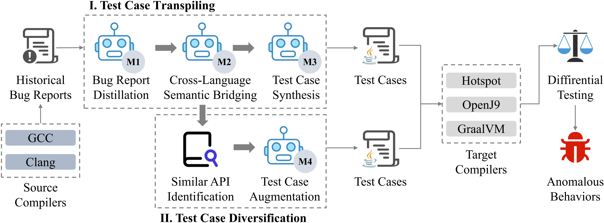

# CrossFuzz

CrossFuzz is a tool for cross-language compiler testing. The workflow of CrossFuzz is as follows:

<!-- 插入图片 -->


## Usage

### 1. Download and install CrossFuzz

```bash
git clone https://github.com/0x434f727265737300/crossfuzz.git
cd crossfuzz
pip install -r requirements.txt
```

### 2. Download and install compilers

The versions of target JVMs are as follows:

### 3. Run CrossFuzz

### Auxiliary Tool

`clean.sh`: clean the files created during differential testing (e.g., crash reports, files created by file operation, etc.).
`step4_1_filter.py`: The filter script for anomalous behaviors.
`step4_2_run_one.py`: Reproduce anomalous behaviors.

